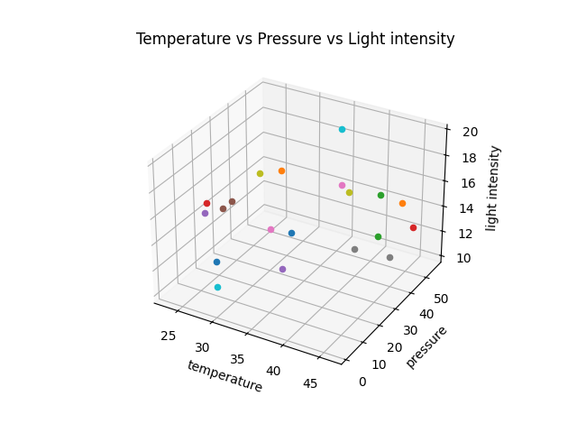
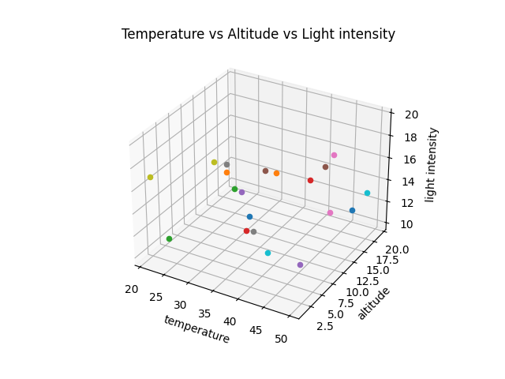
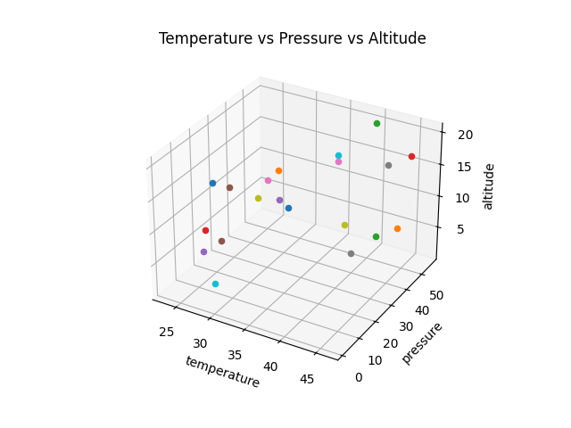
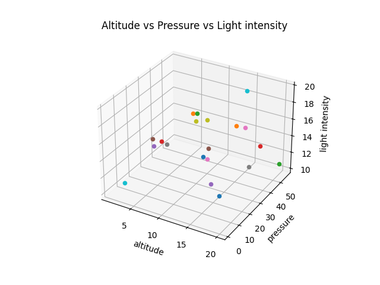

# Sensor Data Analysis Report Rover

## Sensors Used:

| Sensor Type   | Model         | Power Rating | Precision and units |
|---------------|---------------|--------------|----------------------|
| Temperature   | [Temperature_Sensor_Model] | [Temperature_Sensor_Manufacturer] | [Any relevant info about the temperature sensor] |
| Pressure      | [Pressure_Sensor_Model]    | [Pressure_Sensor_Manufacturer]    | [Any relevant info about the pressure sensor] |
| Altitude      | [Altitude_Sensor_Model]    | [Altitude_Sensor_Manufacturer]    | [Any relevant info about the altitude sensor] |
| Light Level   | [Light_Level_Sensor_Model] | [Light_Level_Sensor_Manufacturer] | [Any relevant info about the light level sensor] |

---
## Temperature Sensor Data
- **Readings:** [Temperature_Readings]
- **Error:** [Temperature_Error_Percent]

## Temperature Sensor Report
- **Mean:** 15.318410719304138 °C
- **Median:** 13.089103773175498 °C
- **Mode:** 19.444451992887863 °C
- **Variance:** 15.330914362953125 °C
- **Standard Deviation:** 3.915471154657269 °C

---
## Pressure Sensor Data
- **Readings:** [Pressure_Readings]
- **Error:** [Pressure_Error_Percent]

## Pressure Sensor Report
- **Mean:** 76.33941463086711 Pa
- **Median:** 76.31765776525953 Pa
- **Mode:** 92.16338702016864 Pa
- **Variance:** 118.06180544774315 Pa
- **Standard Deviation:** 10.865624945107536 Pa

---

## Altitude Sensor Data
- **Readings:** [Altitude_Readings]
- **Error:** [Altitude_Error_Percent]

## Altitude Sensor Report
- **Mean:** 25189.598640403983 cm
- **Median:** 24400.900363500718 cm
- **Mode:** 23635.65834508031 cm
- **Variance:** 47472.62872665182 cm
- **Standard Deviation:** 2178.821441207421 cm
---
## Light Level Sensor Report
- **Readings:** [Light_Level_Readings]
- **Error:** [Light_Level_Error_Percent]
## Light Level Sensor Report

- **Mean:** 95.40410190219043 Candela
- **Median:** 133.57618207777136 Candela
- **Mode:** 22.422009173480223 Candela
- **Variance:** 2618.0686450881135 Candela
- **Standard Deviation:** 51.16706601993233 Candela

---
## Graphs

---
*Foot Note: The contents of this report are dynamic in nature and will update on refresh.*
