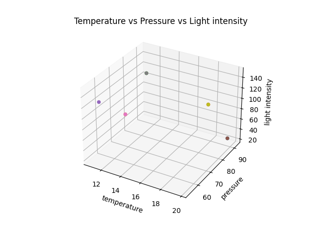
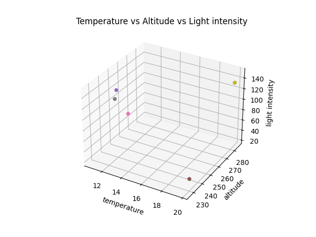

# Sensor Data Analysis Report Rover

## Sensors Used:

| Sensor Type   | Model         | Power Rating | Precision and units |
|---------------|---------------|--------------|----------------------|
| Temperature   | [Temperature_Sensor_Model] | [Temperature_Sensor_Manufacturer] | [Any relevant info about the temperature sensor] |
| Pressure      | [Pressure_Sensor_Model]    | [Pressure_Sensor_Manufacturer]    | [Any relevant info about the pressure sensor] |
| Altitude      | [Altitude_Sensor_Model]    | [Altitude_Sensor_Manufacturer]    | [Any relevant info about the altitude sensor] |
| Light Level   | [Light_Level_Sensor_Model] | [Light_Level_Sensor_Manufacturer] | [Any relevant info about the light level sensor] |

---
## Temperature Sensor Data
- **Readings:** [Temperature_Readings]
- **Error:** [Temperature_Error_Percent]

## Temperature Sensor Report
- **Mean:** [Temperature_Mean_Value]
- **Median:** [Temperature_Median_Value]
- **Mode:** [Temperature_Mode_Value]
- **Variance:** [Temperature_Variance_Value]
- **Standard Deviation:** [Temperature_Standard_Deviation_Value]

---
## Pressure Sensor Data
- **Readings:** [Pressure_Readings]
- **Error:** [Pressure_Error_Percent]

## Pressure Sensor Report
- **Mean:** [Pressure_Mean_Value]
- **Median:** [Pressure_Median_Value]
- **Mode:** [Pressure_Mode_Value]
- **Variance:** [Pressure_Variance_Value]
- **Standard Deviation:** [Pressure_Standard_Deviation_Value]

---

## Altitude Sensor Data
- **Readings:** [Altitude_Readings]
- **Error:** [Altitude_Error_Percent]

## Altitude Sensor Report
- **Mean:** [Altitude_Mean_Value]
- **Median:** [Altitude_Median_Value]
- **Mode:** [Altitude_Mode_Value]
- **Variance:** [Altitude_Variance_Value]
- **Standard Deviation:** [Altitude_Standard_Deviation_Value]
---
## Light Level Sensor Report
- **Readings:** [Light_Level_Readings]
- **Error:** [Light_Level_Error_Percent]
## Light Level Sensor Report

- **Mean:** [Light_Level_Mean_Value]
- **Median:** [Light_Level_Median_Value]
- **Mode:** [Light_Level_Mode_Value]
- **Variance:** [Light_Level_Variance_Value]
- **Standard Deviation:** [Light_Level_Standard_Deviation_Value]

---
## Graphs

---
*Foot Note: The contents of this report are dynamic in nature and will update on refresh.*
