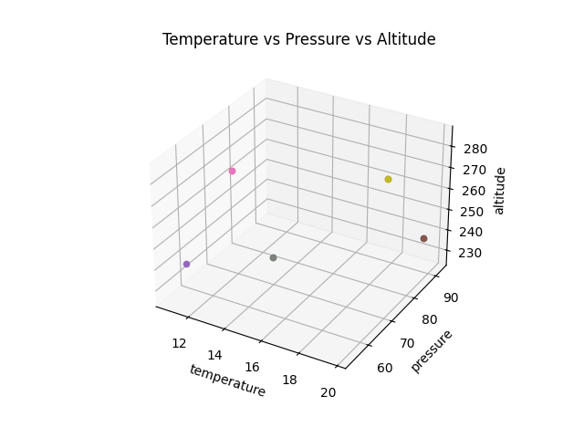
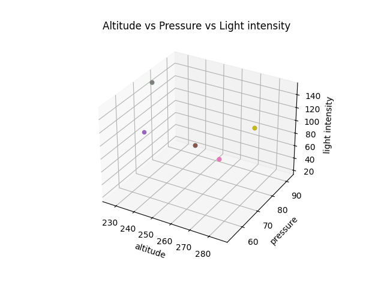

# Sensor Data Analysis Report [RoverName]

## Sensors Used:

| Sensor Type   | Model         | Power Rating | Precision and units |
|---------------|---------------|--------------|----------------------|
| Temperature   | [Temperature Sensor Model] | [Temperature Sensor Manufacturer] | [Any relevant info about the temperature sensor] |
| Pressure      | [Pressure Sensor Model]    | [Pressure Sensor Manufacturer]    | [Any relevant info about the pressure sensor] |
| Altitude      | [Altitude Sensor Model]    | [Altitude Sensor Manufacturer]    | [Any relevant info about the altitude sensor] |
| Light Level   | [Light Level Sensor Model] | [Light Level Sensor Manufacturer] | [Any relevant info about the light level sensor] |

---
## Temperature Sensor Data
- **Dataset:** [Temperature Readings]
- **Error:** [Temperature Error Percent]

## Temperature Sensor Report
- **Mean:** [Temperature Mean Value]
- **Median:** [Temperature Median Value]
- **Mode:** [Temperature Mode Value]
- **Mean Deviation about Mean:** [Temperature Mean Deviation about Mean Value]
- **Variance:** [Temperature Variance Value]
- **Standard Deviation:** [Temperature Standard Deviation Value]

---
## Pressure Sensor Data
- **Dataset:** [Pressure Readings]
- **Error:** [Pressure Error Percent]

## Pressure Sensor Report
- **Mean:** [Pressure Mean Value]
- **Median:** [Pressure Median Value]
- **Mode:** [Pressure Mode Value]
- **Mean Deviation about Mean:** [Pressure Mean Deviation about Mean Value]
- **Variance:** [Pressure Variance Value]
- **Standard Deviation:** [Pressure Standard Deviation Value]

---

## Altitude Sensor Data
- **Dataset:** [Altitude Readings]
- **Error:** [Altitude Error Percent]

## Altitude Sensor Report
- **Mean:** [Altitude Mean Value]
- **Median:** [Altitude Median Value]
- **Mode:** [Altitude Mode Value]
- **Mean Deviation about Mean:** [Altitude Mean Deviation about Mean Value]
- **Variance:** [Altitude Variance Value]
- **Standard Deviation:** [Altitude Standard Deviation Value]
---
## Light Level Sensor Report
- **Dataset:** [Light Level Readings]
- **Error:** [Light Level Error Percent]

## Light Level Sensor Report

- **Mean:** [Light Level Mean Value]
- **Median:** [Light Level Median Value]
- **Mode:** [Light Level Mode Value]
- **Mean Deviation about Mean:** [Light Level Mean Deviation about Mean Value]
- **Variance:** [Light Level Variance Value]
- **Standard Deviation:** [Light Level Standard Deviation Value]

---
## Graphs

---
*Foot Note: The contents of this report are dynamic in nature and will update on refresh.*
